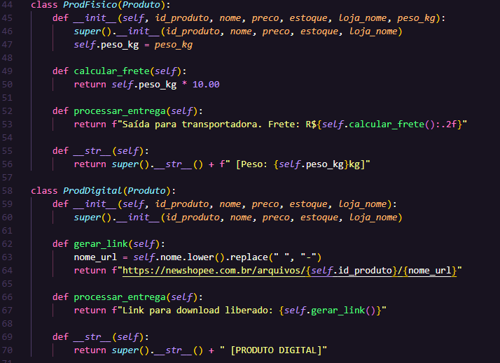
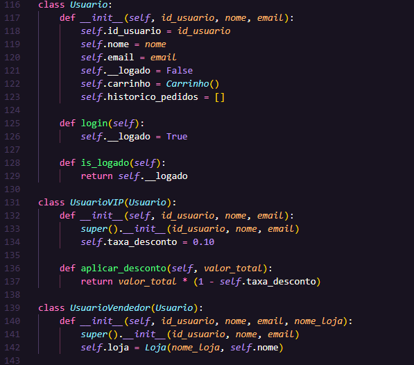
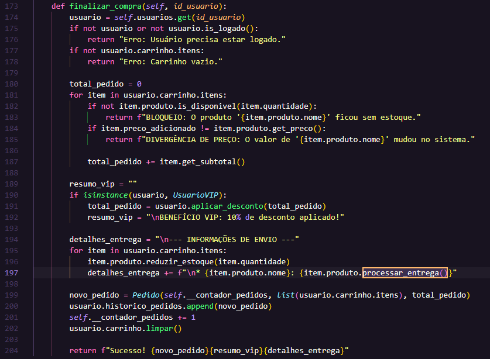

# 🛒 Documentação do Projeto: 'NEW Shopee' (Marketplace)

**Aluno:** Ricardo Pinto Cardoso Júnior  
**Aplicativo de Referência:** Shopee  
**Problema Relatado:** A plataforma apresenta problemas relacionados à divergência de preços nos anúncios e à venda de produtos fora de estoque (gerando vendas "fantasmas" e impacto negativo nas métricas do vendedor). 

**Solução Implementada:** Construção de um sistema em Python utilizando Orientação a Objetos (Encapsulamento, Herança, Polimorfismo e Classes Abstratas) para blindar a alteração de preços e gerenciar o estoque rigorosamente.

---

## 📄 Parte 1: Documentação das Funcionalidades 

O sistema foi modelado com as seguintes 10 funcionalidades principais:

### 1. Cadastro e Autenticação de Usuários
* **Objetivo:** Permite que usuários (Compradores ou Vendedores) sejam registrados e façam login na plataforma.
* **Funcionamento no Código:** Controlado pelo método `registrar_usuario()` na classe `Marketplace` e pelo método `login()` na classe `Usuario`.
* **Princípio Operacional:** Após `cadastrar(u)`, *u* pertence ao conjunto *cadastrado*. Após `login(u)`, *u* pertence ao conjunto *logado*.

### 2. Cadastro de Vendedores e Criação de Loja
* **Objetivo:** Permite que usuários se registrem como vendedores e gerenciem sua própria loja.
* **Funcionamento no Código:** Implementado pela classe filha `UsuarioVendedor`, que inicializa automaticamente uma instância da classe `Loja`.
* **Princípio Operacional:** Após `registrar_vendedor(v)`, *v* pertence ao conjunto *vendedor_registrado*. A loja é criada vinculada a este usuário.

### 3. Publicação de Anúncios de Produtos
* **Objetivo:** Permite que vendedores publiquem produtos (Físicos ou Digitais) no marketplace.
* **Funcionamento no Código:** Realizado pelo método `publicar_produto()` dentro da classe `Loja`.
* **Princípio Operacional:** Após `publicar(p)`, *p* pertence ao conjunto *anunciado*. Se o estoque for 0, *p* passa para o estado *indisponível*.

### 4. Sistema de Busca e Catálogo de Produtos
* **Objetivo:** Permite que usuários visualizem o catálogo de todas as lojas para encontrar produtos.
* **Funcionamento no Código:** Acessado através da Opção 1 do menu, que itera sobre o `catalogo` de todas as lojas registradas no `Marketplace`.
* **Princípio Operacional:** O sistema retorna e exibe os produtos *p* pertencentes ao conjunto *disponível*.

### 5. Carrinho de Compras Inteligente
* **Objetivo:** Permite que os usuários guardem itens para compra, agrupando produtos iguais para evitar burlar o estoque.
* **Funcionamento no Código:** Implementado pela classe `Carrinho` e seu método `adicionar()`, que cria instâncias de `ItemCarrinho`.
* **Princípio Operacional:** Após `adicionar(p)`, *p* pertence ao carrinho. O sistema guarda não apenas o produto, mas o preço exato do momento da adição.

### 6. Sistema de Pagamento (Finalização com Desconto)
* **Objetivo:** Permite processar o fechamento do carrinho e aplicar benefícios caso o usuário seja VIP.
* **Funcionamento no Código:** Gerenciado pelo método `finalizar_compra()`. Identifica (via polimorfismo) a aplicação de descontos através da classe `UsuarioVIP`.
* **Princípio Operacional:** O carrinho é lido e o valor total calculado. Após `finalizar_compra(o)`, o pedido passa para o estado *confirmado*.

### 7. Histórico de Pedidos e Acompanhamento
* **Objetivo:** Guardar o registro imutável das compras finalizadas com sucesso.
* **Funcionamento no Código:** Cada finalização bem-sucedida gera um objeto da classe `Pedido`, que é anexado à lista `historico_pedidos` do usuário.
* **Princípio Operacional:** Após a confirmação, o pedido *o* pertence ao conjunto *registrado* do usuário logado.

### 8. Verificação Rigorosa de Estoque (A Solução do Problema)
* **Objetivo:** Evita a compra de produtos que acabaram de ficar sem estoque, resolvendo o bug relatado.
* **Funcionamento no Código:** Uso do método encapsulado `is_disponivel()` na classe `Produto`. Ele é testado tanto ao adicionar ao carrinho quanto no exato momento de finalizar a compra.
* **Princípio Operacional:** Antes de confirmar o pedido, o sistema varre o carrinho. Se a quantidade exigida for maior que o estoque, a venda é bloqueada.

### 9. Redução Automática de Estoque
* **Objetivo:** Atualiza o inventário do vendedor imediatamente após o fechamento da venda.
* **Funcionamento no Código:** Realizado pelo método seguro `reduzir_estoque()` na superclasse abstrata `Produto`.
* **Princípio Operacional:** Após aprovar o pedido, `estoque(p)` é subtraído e os atributos privados são atualizados de forma protegida.

### 10. Validação Anti-Divergência de Preço (A Solução do Problema)
* **Objetivo:** Garante que o usuário pague exatamente o valor anunciado no momento em que colocou no carrinho, evitando fraudes de preço.
* **Funcionamento no Código:** Durante `finalizar_compra()`, o sistema compara `item.preco_adicionado` (do carrinho) com `item.produto.get_preco()` (do sistema). Se houver diferença, a compra é embargada.
* **Princípio Operacional:** O sistema valida a igualdade de valores. Se forem diferentes, o erro "DIVERGÊNCIA DE PREÇO" é disparado e o estado *preco_valido* é anulado.

## 🧬 Parte 2: Aplicação de Herança

A herança foi um pilar fundamental na construção deste sistema para garantir o reaproveitamento de código e a fácil escalabilidade do projeto. O mecanismo foi utilizado em duas frentes principais: na modelagem dos Produtos e na modelagem dos Usuários.

### Caso 1: Herança na Hierarquia de Produtos

**Onde foi utilizado:**
As classes filhas `ProdFisico` e `ProdDigital` herdam da classe mãe abstrata `Produto`.

**Motivação / Justificativa:**
* **Reuso de Código:** Evitou a repetição exaustiva de atributos comuns. Todo produto, seja físico ou digital, possui `id`, `nome`, `preco`, `estoque` e `loja`. A classe mãe `Produto` centraliza esses dados e os métodos de validação de estoque (`is_disponivel`, `reduzir_estoque`), poupando as classes filhas de reescreverem essa lógica.
* **Segurança e Contrato (Abstração):** Como a classe mãe é uma classe Abstrata (`ABC`), a herança serviu como uma trava de segurança. Ela impede que o sistema instancie um "Produto genérico" e obriga (através do contrato de herança) que toda classe filha implemente sua própria versão do método `processar_entrega()`.

---

### Caso 2: Herança na Hierarquia de Usuários

**Onde foi utilizado:**
As classes filhas `UsuarioVIP` e `UsuarioVendedor` herdam da classe mãe base `Usuario`.

**Motivação / Justificativa:**
* **Especialização de Papéis:** Todos os usuários do sistema precisam de um nome, email, status de login, carrinho de compras e histórico de pedidos. A classe mãe `Usuario` gerencia tudo isso de forma centralizada.
* **Adição de Funcionalidades Específicas:** A herança permitiu que o sistema expandisse as capacidades de usuários específicos sem interferir nos usuários normais. O `UsuarioVIP` herdou tudo da mãe e adicionou a taxa de desconto. O `UsuarioVendedor` herdou tudo da mãe e adicionou uma associação com a classe `Loja`, dando a ele o poder de publicar produtos no marketplace.

## 🎭 Parte 3: Polimorfismo

O polimorfismo foi aplicado no sistema para eliminar estruturas condicionais repetitivas e permitir que o código principal interaja com diferentes tipos de produtos de maneira uniforme.

**Onde aconteceu no código:**
Ocorre no momento do checkout, especificamente no método de finalizar a compra, dentro do laço de repetição `for` que varre os itens do carrinho.

 

**Como funciona e a Motivação Arquitetural:**
A verdadeira inteligência e flexibilidade do código se revelam na linha de comando única: `item.produto.processar_entrega()`. 

Nesta etapa, o sistema não utiliza condicionais `if` ou `else` para perguntar ou investigar o tipo do produto (por exemplo, `isinstance`). O laço `for` simplesmente envia a mesma ordem para todos os itens do carrinho. 

Quando o comando é enviado, o interpretador do Python identifica qual é a **subclasse que está armazenada na memória** naquele exato momento. A partir disso, o Python faz o **despacho dinâmico**, invocando automaticamente o método correspondente:
* Se o objeto armazenado for um `ProdFisico`, ele invoca a regra de cálculo do frete.
* Se for um `ProdDigital`, ele invoca a regra de geração do link de download.

**Conclusão:** O código do carrinho de compras se torna "cego" para os tipos de produtos, confiando totalmente na autonomia das subclasses. Isso torna o sistema escalável: se amanhã a loja decidir vender serviços (`ProdServico`), basta criar a classe. O código principal de vendas continuará o mesmo, sem precisar de manutenção.
